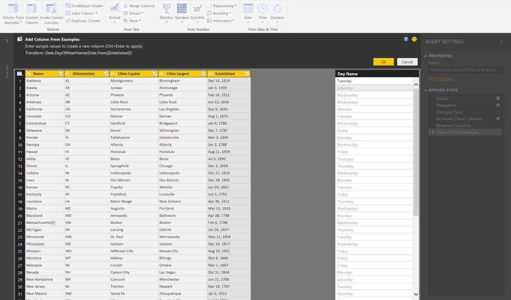

---

title: Smart data preparation capabilities – Add Column from Examples
description: As part of the data transformation capabilities of the Power Query editor, you can easily add a new column of data by providing one or more sample values for the new column.
author: MargoC
manager: AnnBe
ms.date: 05/01/2018
ms.assetid: eed9e68d-7c3f-4730-bea0-04e9ef9c9b55
ms.topic: article
ms.prod: 
ms.service: business-applications
ms.technology: 
ms.author: margoc
audience: Admin

---

# Smart data preparation capabilities – Add Column from Examples

[!include[banner](../../includes/banner.md)]

As part of the data transformation capabilities of the Power Query editor, you
can easily add a new column of data by providing one or more sample values for
the new column. Power Query applies intelligence algorithms to determine the set
of data transformations that need to be applied to infer column results.

This approach is useful in the following situations:

-   You know the data result you want in the new column, but you’re not sure
    which transformation (or collection of transformations) will provide that
    result.

-   You know which transformations you need, but you’re not sure how to do the
    transformations through the user interface.

-   You know which transformations you need, but one (or more) of those
    expressions aren't available in the user interface.

You can access Add Column from Examples from the Add Column tab in the Power
Query editor. Power Query provides suggestions for common operations, based on
columns in context. Suggestions are based on data samples (Tuesday, for example)
and descriptive text (day of the week, for example).

> [!div class="mx-imgBorder"] 
> 

*Add Column from Examples*

> [!div class="mx-imgBorder"] 
> 

*Remaining column rows inferred from example column values*

For more information about inferring values from an example column, go to: [Add
a column from an example in Power BI
Desktop](https://docs.microsoft.com/en-us/power-bi/desktop-add-column-from-example).
