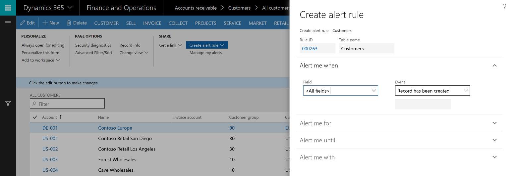

---

title: Alerts
description: Alerts form a notification system for critical events in Finance and Operations.
author: MargoC
manager: AnnBe
ms.date: 06/01/2018
ms.assetid: 5db8aa64-9e38-4787-9d43-9c1483d38751
ms.topic: article
ms.prod: 
ms.service: business-applications
ms.technology: 
ms.author: margoc
audience: Admin

---
#  Alerts

[!include[banner](../../includes/banner.md)]

Alerts form a notification system for critical events in Finance and Operations.
You can use alerts to stay informed about events that you want to track during
the workday. You can easily create your own set of alert rules so that you're
alerted about deliveries that are overdue, orders that are deleted, prices that
change, or other events you must respond to.

> [!div class="mx-imgBorder"] 
> 
<!-- FO_Alerts_A.png -->

*Create alert rule*

When you create an alert rule, you can specify that you want to be alerted when
a specific field changes. For example, suppose that you work in the Sales
department of a company where the number of customer returns has become a major
issue. You want to be alerted about any returned goods, so that you can
immediately start to investigate why the goods are returned. Therefore, you
create a rule that triggers an alert if the Status field of any sales order is
changed to Canceled.

Alternatively, you can specify that you want to be alerted when a record on a
page is created or deleted. For example, you want to make sure that no customers
are deleted on the All customers page without your knowledge. Therefore, you
create a rule that triggers an alert when a record is deleted on that page.

When the selected event occurs for the field or record on the page, an alert is
sent to you. These alerts can help you monitor your business more effectively
and enable you to take corrective action when necessary.

Alerts are processed by the batch processing functionality in Finance and
Operations. You must set up batch processing before alerts can be delivered.
