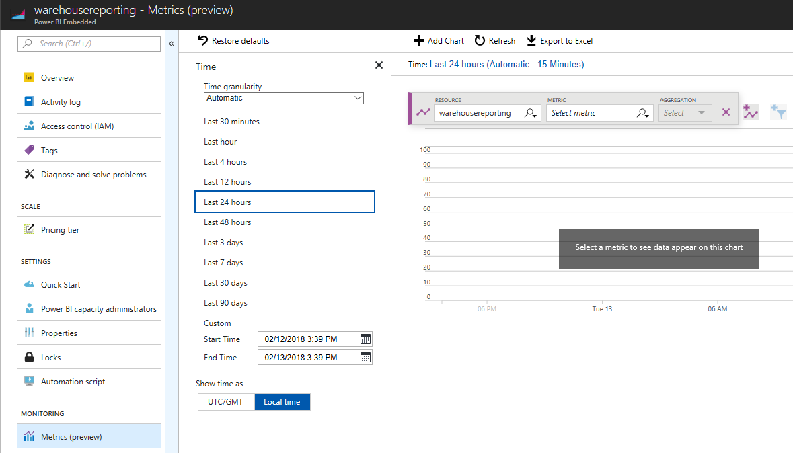

---

title: Azure monitoring
description: To optimize the use of an Azure resource in Power BI Embedded, we are adding the ability to monitor and track the usage and act on any changes.
author: MargoC
manager: AnnBe
ms.date: 05/01/2018
ms.assetid: b3029f90-414e-4e40-899a-a48a1c679be5
ms.topic: article
ms.prod: 
ms.service: business-applications
ms.technology: 
ms.author: margoc
audience: Admin

---
#  Azure monitoring

[!include[banner](../../../includes/banner.md)]

To optimize the use of an Azure resource in Power BI Embedded, we are adding the
ability to monitor and track the usage and act on any changes. This is enabled
through the integration with [Azure Monitor Resource
Metrics](https://docs.microsoft.com/en-us/azure/monitoring-and-diagnostics/monitoring-overview-metrics),
which gives real-time data on the status and load of the Azure resource in an
easy-to-use UI within the Azure portal, as well as through [PowerShell
commands](https://docs.microsoft.com/en-us/powershell/module/azurerm.insights/get-azurermmetric?view=azurermps-5.3.0)
and [REST APIs](https://docs.microsoft.com/en-us/rest/api/monitor/metrics/list)
to automatically monitor the resources. The data can be viewed using different
measures and time periods.

> [!div class="mx-imgBorder"] 
> 
<!-- picture -->

*Azure monitoring example*

We are adding two new metrics to track the load of the Power BI Embedded
resource:

-   **Query duration.** Provides information about the duration to complete each
    query. In this case, a spike in the average duration time can be an
    indication that the current capacity doesn’t have enough query processing
    units (virtual cores) to process the queries, and you should consider
    scaling to a higher capacity.

    The threshold to scale up or down depends on the developer’s decision and can
vary based on the data and the type of queries that are running.

-   **Query pool queue length.** Provides information about the number of
    queries waiting to be processed. A spike in the number of queries might
    indicate that your capacity has too many datasets being queried at the same
    time, causing pagination in memory and thus more queries are waiting to be
    processed. In this case, you should consider scaling up to get more RAM. For
    the amount of memory available for each capacity, see [Power BI Embedded
    pricing](https://azure.microsoft.com/en-us/pricing/details/power-bi-embedded/).
