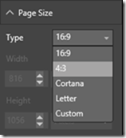
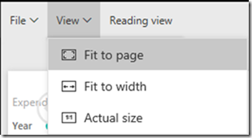

---

title: Custom layout
description: You can use custom layout to set and change the size of a report page layout or control the size, position, and visibility of a report visual.
author: MargoC
manager: AnnBe
ms.date: 06/01/2018
ms.assetid: fb64c300-7f75-49d4-8ae1-14435d8378fd
ms.topic: article
ms.prod: 
ms.service: business-applications
ms.technology: 
ms.author: margoc
audience: Admin

---
#  Custom layout

[!include[banner](../../../includes/banner.md)]

You can use custom layout to set and change the size of a report page layout or
control the size, position, and visibility of a report visual.

-   **Page layout.** When you build a report page through Power BI Desktop, you
    configure the layout using two fields: page size type and page layout.

    > [!div class="mx-imgBorder"] 
    > 

    *Page size options*

    > [!div class="mx-imgBorder"] 
    > 
    <!-- Picture 21 -->

    *Page layout options*

    By default, each time you embed a report, it uses the configuration made in
Power BI Desktop. With custom layout, you can dynamically set the definitions to
optimize the report layout inside the application page. You can change the
layout during the session based on events such as a content change or browser
resizing.

-   **Visual layout.** This feature supports [single visual
    embedding](single-visual-embedding.md). With custom layout, you define which
    visuals to display and specify their size and position on the canvas. You
    have full configuration control of appearance of visuals on the canvas
    dynamically during user sessions.

    For example, assume that your application’s customer has different departments.
Instead of creating copies of the same report or report pages for each
department and making the modifications, you can show the same report page and
expose only the relevant visuals to that user. Using custom layout, you can
optimize the position of each visual.
