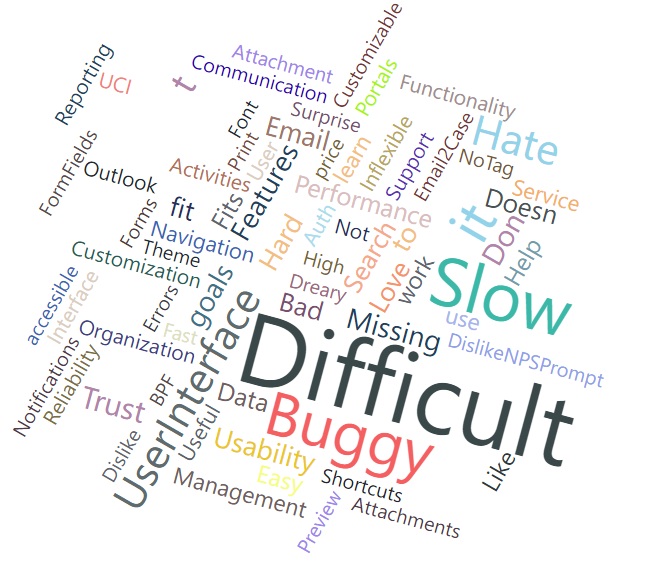

---

title: Customer Service  core  release notes
description: Dynamics 365 for Customer Service continues to deliver capabilities that enable customer service organizations to operate at scale efficiently.
author: MargoC
manager: AnnBe
ms.date: 5/14/2018
ms.assetid: dd3a539b-eef7-4cd9-90f0-2c42873dc2aa
ms.topic: article
ms.prod: 
ms.service: business-applications
ms.technology: 
ms.author: margoc
audience: Admin

---
#  Customer Service (core) release notes

[!include[banner](../../../includes/banner.md)]

Dynamics 365 for Customer Service continues to deliver capabilities that enable
customer service organizations to operate at scale efficiently. A strong focus
on the fundamentals makes the app more reliable and performant. This release
helps customer service organization to monitor their services effectively and
self-heal potential issues even before they impact productivity. System
integrators (SI) will be able to deliver best in class customization to end
customers by ensuring that the customization/ implementation is compliant to the
best practices. These investments in fundamentals will result in reduced
down-time, improved performance and ease of use and faster resolution of support
issues.

Unified Service Desk continues its efforts towards stronger fundamentals, i.e.
better reliability and a proactive diagnostic experience for customers by
enabling service and performance health telemetry scenarios. USD will align to
the overall Customer Service health reporting (Project Bedrock). In coming
release, Unified Service Desk will provide options to the customers running
Windows 10, to host web applications using the Edge Process. This will also
contribute to addressing reliability and performance issues attributed to the
Internet Explorer.

| Oct ’18 | **General Availability**                                                                                                   |
|---------|----------------------------------------------------------------------------------------------------------------------------|
|         | [Reliability Attainment across scenarios](reliability-attainment-across-scenarios-goal-99-99.md)                                               |
|         | [Performance Attainment across scenarios ](performance-attainment-across-scenarios-goal-org-specific.md)                                                |
|         | [Proactive Alerts on Reliability and Performance threshold violations on org specific scenarios. ](proactive-alerts-reliability-performance-threshold-violations-org-specific-scenarios.md)  |
|         | [Reporting through common schema and one Cosmos reporting (Project bedrock) [Internal Focus]](reporting-common-schema-one-cosmos-reporting-project-bedrock.md)  |
|         | [Unified Service Desk: Stronger Fundamentals (Reliability and Proactive Diagnostics). ](_Unified_Service_Desk:_1)         |
| Oct ’18 | **Public Preview**                                                                                                         |
|         | [Enhanced Org insights for Customer Service self-heal (OOB and Customization) ](enhanced-org-insights-customer-service-self-heal-oob-customization.md)                   |
|         | [Unified Service Desk: Using Edge Process for hosting web applications in Unified Service Desk](_Unified_Service_Desk:_1) |
|         |                                                                                                                            |

\< Internal only

NPS for Customer Service is currently at -48 %. The following graphic depicts
the word cloud based on categorization of the comments.

We understand the underlying issue(s) for the tags “Difficult” , “Slow”,
“Buggy”, “Performance”, “Reliability” through telemetry measures. The following
investments help in improving the reliability and performance of Customer
Service App and enabling customers to self-diagnose and self-heal before the
issues impact productivity and user satisfaction.

/Internal only\>

