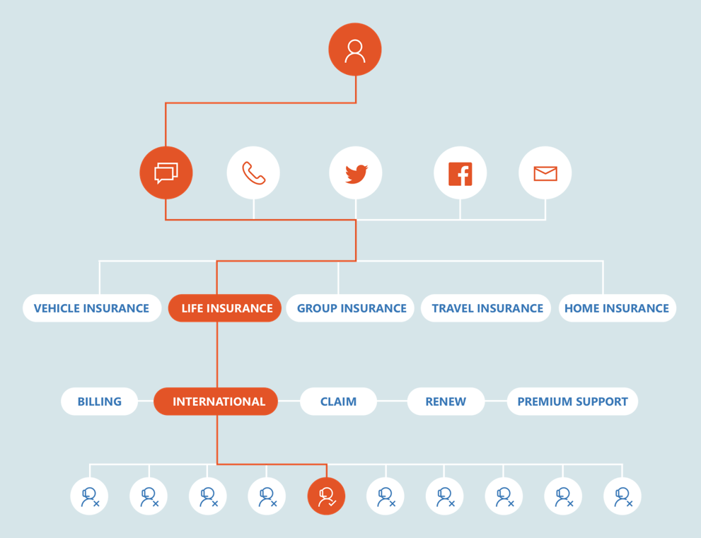

---

title: Unified Routing and Work Distribution
description: Organizations can leverage the unified routing and work distribution capabilities to channelize the work items originating from Chat, messaging and Web Portal channels to different Customer Service support teams within the organization.
author: MargoC
manager: AnnBe
ms.date: 5/14/2018
ms.assetid: ee759f9f-6625-4dd2-8c55-1c6d0d134038
ms.topic: article
ms.prod: 
ms.service: business-applications
ms.technology: 
ms.author: margoc
audience: Admin

---
#  Unified Routing and Work Distribution 

[!include[banner](../../../includes/banner.md)]

Organizations can leverage the unified routing and work distribution
capabilities to channelize the work items originating from Chat, messaging and
Web Portal channels to different Customer Service support teams within the
organization. Through the configuration interfaces, organizations can tightly
define the work profile that their agents are supposed to handle and during
runtime, system will automate the flow of work to various agents based on their
capacity and presence availability.

<!-- picture -->

Unified Routing and Work Distribution System would enable organizations to
achieve the following objectives:

-   Agent attention is always utilized for the most urgent tasks

-   Organizations can track agent utilization at a granular level and make
    appropriate process improvements

-   Unify the work items and requests across channels and asynchronous work
    items like Cases, Leads, Call Backs, Scheduled Tasks, etc.
