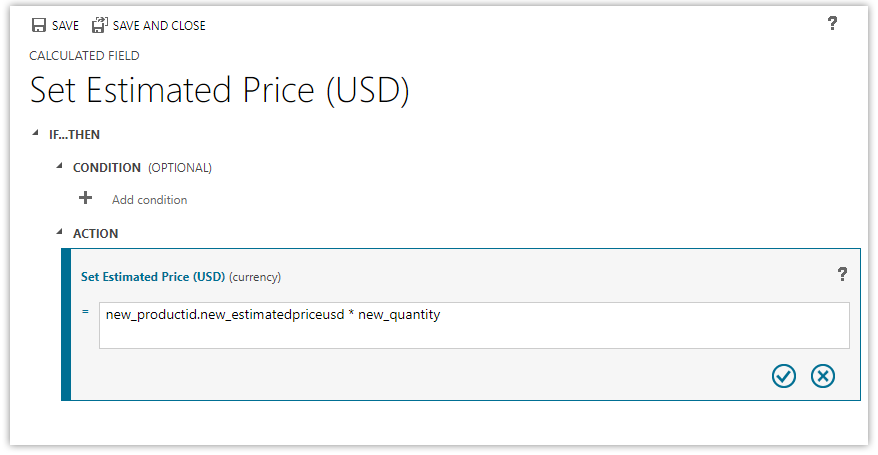

---

title: Calculated and rollup fields
description: Calculated and rollup fields on Common Data Service for Apps entities make it possible to easily compute values for any field and summarize multiple records in a single rollup calculation.
author: MargoC
manager: AnnBe
ms.date: 5/1/2018
ms.assetid: db73fafa-b09d-41d1-8485-88563947f886
ms.topic: article
ms.prod: 
ms.service: business-applications
ms.technology: 
ms.author: margoc
audience: Admin

---
#  Calculated and rollup fields

[!include[banner](../../../includes/banner.md)]

Calculated and rollup fields on Common Data Service for Apps entities make it
possible to easily compute values for any field and summarize multiple records
in a single rollup calculation.

Create calculated and rollup fields when you need to:

-   Create number-based calculations by using Excel-like formulas.

-   Concatenate and update text.

-   Create calculations by using values from related entities.

-   Create rollups of number fields.

-   Apply conditional calculations based on values in other fields.

-   Create rollups of date fields (for example, MAX(Datefield)).

<!-- Picture 13 -->

Calculated field

For more information about calculated fields, go to [Define calculated fields to
automate manual
calculations](https://docs.microsoft.com/en-us/dynamics365/customer-engagement/customize/create-business-rules-recommendations-apply-logic-form).
For information about rollup fields, go to [Define rollup fields that aggregate
values](https://docs.microsoft.com/en-us/dynamics365/customer-engagement/customize/create-business-rules-recommendations-apply-logic-form).
