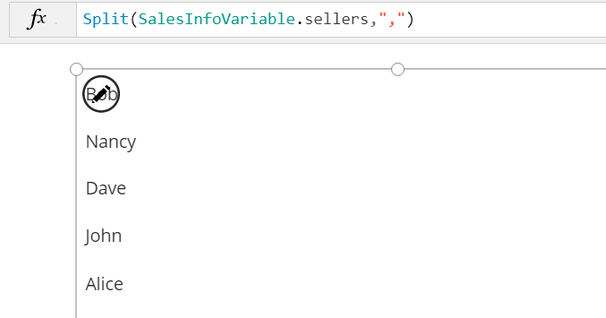

---

title: Step Three
description: The last step is to add your flow to the PowerApp in the formula bar.
author: MargoC
manager: AnnBe
ms.date: 05/01/2018
ms.assetid: edce2bf7-c491-4c73-a93c-26f1d2856bc5
ms.topic: article
ms.prod: 
ms.service: business-applications
ms.technology: 
ms.author: margoc
audience: Admin

---
#  Step Three

[!include[banner](../../../../includes/banner.md)]

The last step is to add your flow to the PowerApp in the formula bar. Select the
control to run your flow from, and then, on the **Action** tab on the ribbon,
select **Flow**. Select the flow you created to add it to the formula bar, and
pass any parameters that the flow requires.

<!-- Picture 42 -->

*Set variable*

We recommend that you use **Set()** or **UpdateContext()** to set a variable
that stores the result of your flow. That way, if multiple values are returned
from the flow, you can access different properties in various places in your
app. For example, the preceding flow returns two properties, **most_sales** and
**sellers**, and you can use either on a control.

<!-- Picture 43 -->

*View result properties*

Today, you can return basic types such as Text or Email. However, there might be
cases where you want to return a list of data to the PowerApp, such as a list of
names. In this case, you can use the **Join** action inside your flow and then
use the **Split** function in your PowerApp.

<!-- Picture 44 -->

*Use results in the gallery*

In the preceding example, notice that the result of the flow is set in
SalesInfoVariable, and then the gallery is bound to the table output by
splitting the names on a comma. If you have an array of objects in the flow, use
the **Select** action first, to choose the property you want to pass to the
PowerApp before joining the array.
