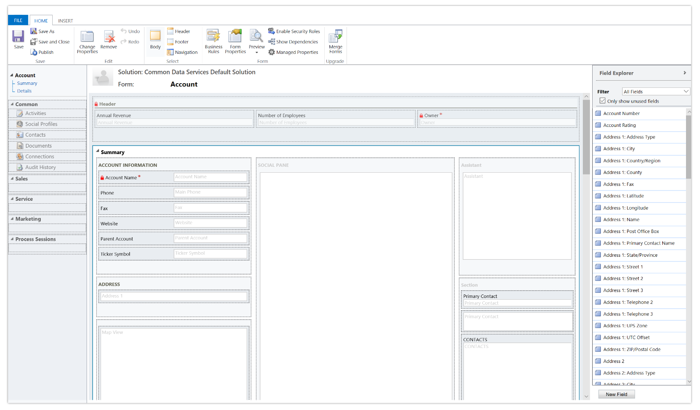

---

title: Entity forms
description: Entity forms
author: MargoC
manager: AnnBe
ms.date: 5/1/2018
ms.assetid: aa6ab60f-fbea-4be1-8e9a-3e8bfa7bf17f
ms.topic: article
ms.prod: 
ms.service: business-applications
ms.technology: 
ms.author: margoc
audience: Admin

---
#  Entity forms 

[!include[banner](../../../../includes/banner.md)]

Model-driven entity forms are a critical component in any Dynamics 365
application and are now available for standalone model‑driven apps built with
PowerApps.

Entity forms include the following features:

-   Multiple tabs. Craft purpose-built tabs for any entity.

-   Sub-grids. Show a list of related records from another entity.

-   Automatic responsive reflow. Forms adapt automatically to the type and size
    of device, and to various web browser resolutions.

-   Form-factor targeting. Choose custom controls that are shown only on mobile,
    for a purpose-built view.

-   Embedded business flow. Guide users through a specific set of steps.

-   Navigation. Add navigation links to other related entities.

<!-- Picture 3 -->

*Form designer*

[For more information about using the form designer, go to Overview of the form
editor
interface.](https://docs.microsoft.com/en-us/dynamics365/customer-engagement/customize/form-editor-user-interface-legacy)

