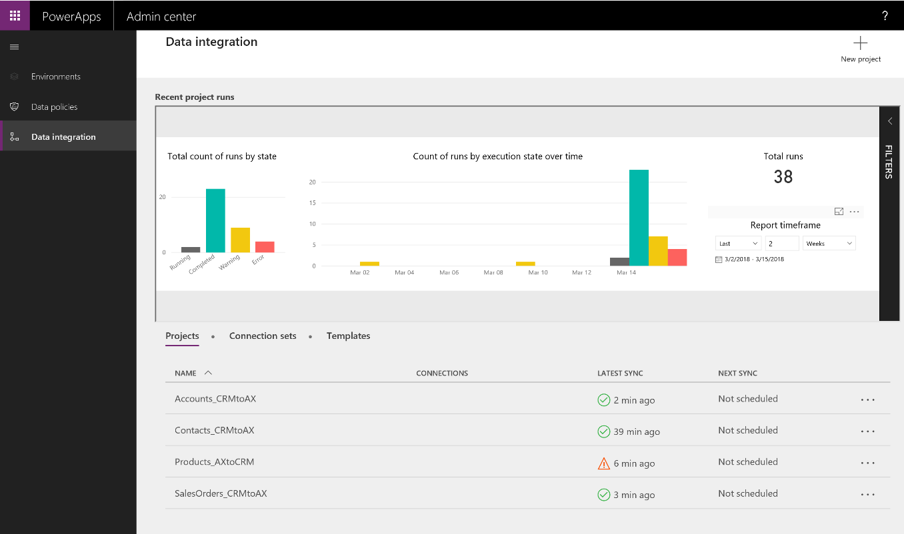
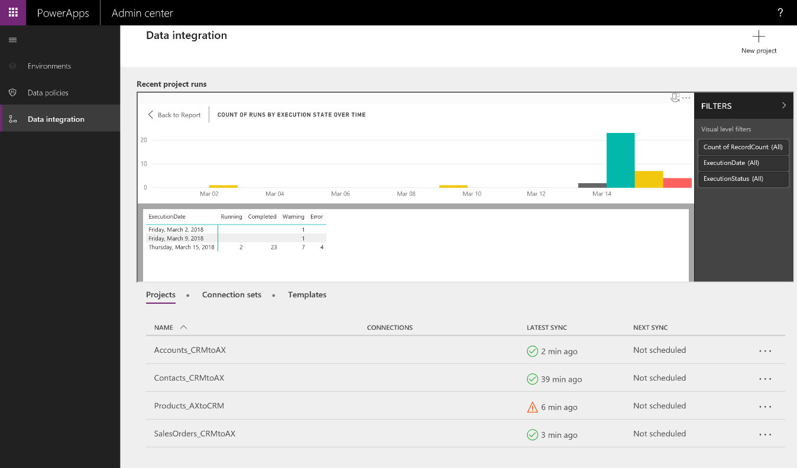
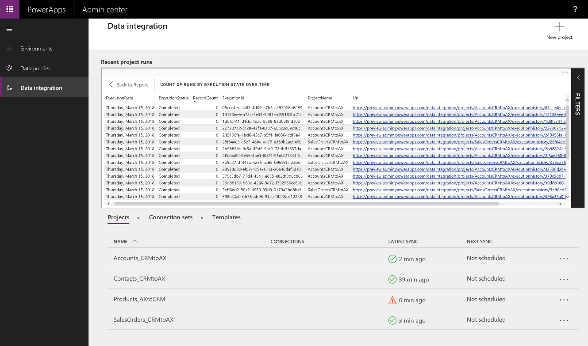
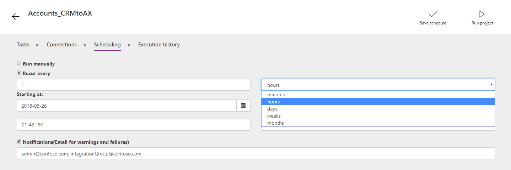
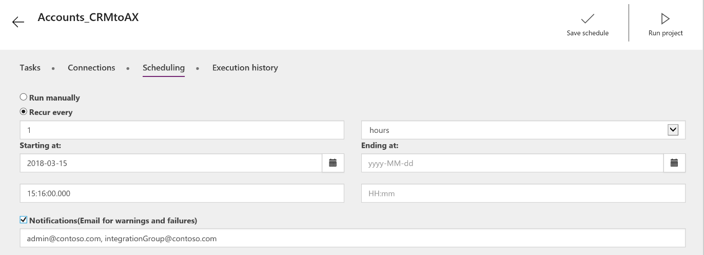
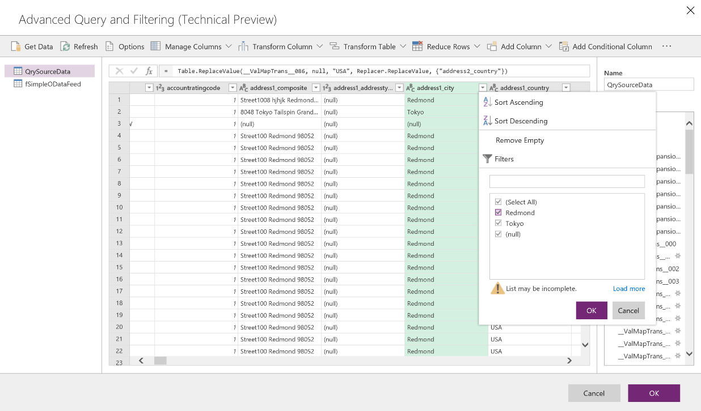
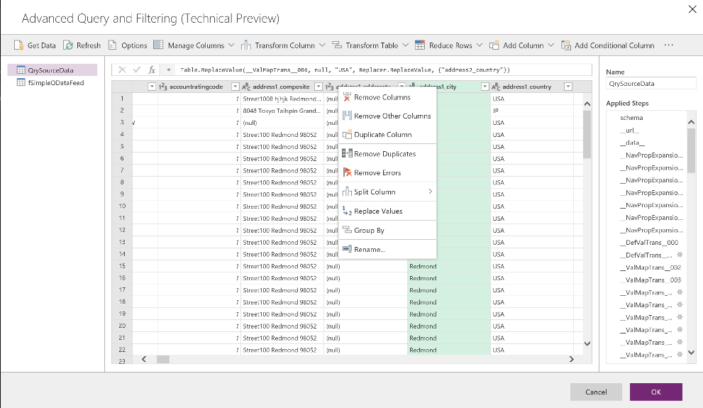
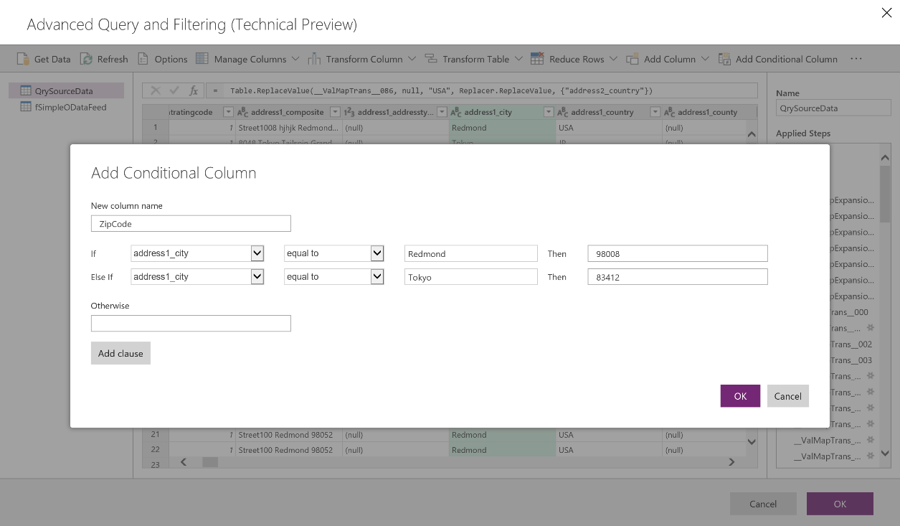
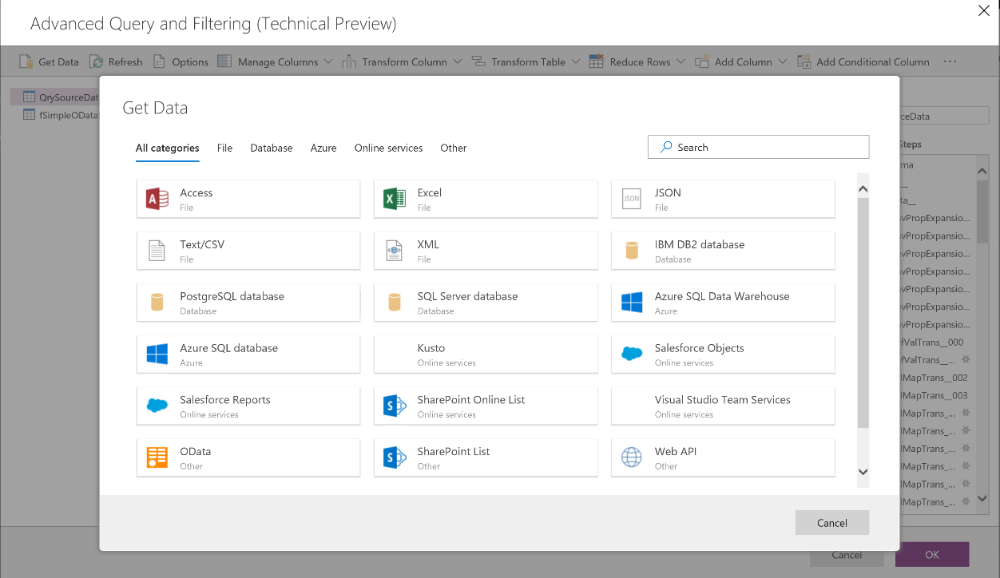

---

title: Data integration capabilities for admins
description: The Data Integrator for the Common Data Service for Apps includes many improvements for admins.
author: MargoC
manager: AnnBe
ms.date: 05/01/2018
ms.assetid: a86c676d-78c4-49a5-868a-3e460b6c9cc2
ms.topic: article
ms.prod: 
ms.service: business-applications
ms.technology: 
ms.author: margoc
audience: Admin

---

# Data integration capabilities for admins

[!include[banner](../../includes/banner.md)]

The Data Integrator for the Common Data Service for Apps includes many
improvements for admins.

##### Admin dashboard for monitoring

The admin dashboard provides a one-stop, real-time view of project runs and
status, with drill-down for execution details. The dashboard shows the total
count of runs by state and by execution state over time.

The color-coding shows the status of each project: green for completed projects,
yellow for completed projects with warnings, and red for failures. By default,
the view shows executions for the previous two weeks. Customize a report by
accessing the Report timeframe menu.

*Admin dashboard for monitoring*

The bar chart provides a quick lookup of the project execution date, the status,
and the count of records that were updated. You can customize the view by
right-clicking the bar chart and show the data in a split view. To change the
subset of records, use the visual filters.

*Admin dashboard in split view*

Another way to determine the cause of a failed project execution is to drill
down to the specific record that failed to synchronize.

*Admin dashboard showing record drill-down*

##### Data Integrator Scheduler 

Use the Data Integrator Scheduler to refresh data on a regular schedule. Run
projects manually or set up a recurrence that refreshes your project on an
hourly, daily, weekly, or monthly schedule. You can refresh as often as every
minute. You can also add start and end dates and times.

*Data Integrator Scheduler configuration screen*

##### Email notifications

If you’re on the move, you can continue to monitor the health of your projects
with email notifications. When you select the Notifications check box on the
Scheduling tab, you’re automatically alerted when jobs are completed or when
they fail due to errors.

*Data Integrator email notification configuration screen*

##### Power Query support for Data Integrator 

[!include[banner](../../includes/public-preview.md)]

The Data Integrator uses the familiar Power Query user interface to mash up
source data before loading it into the Common Data Service. Use Power Query to
filter, transform, and target data from a variety of external resources—without
writing a single line of code.

*Filtering with Power Query*

*Transforming data with Power Query*

*Conditional data transformation with Power Query*

*Get data from external sources*
