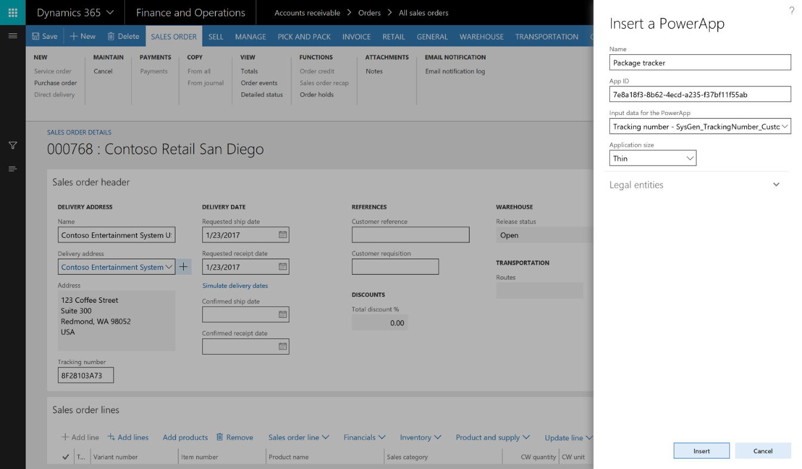

---

title: Embedding PowerApps in workspaces and forms
description: We have added support for embedding PowerApps in Finance and Operations workspaces and forms.
author: MargoC
manager: AnnBe
ms.date: 5/1/2018
ms.assetid: dd712958-9f92-4070-9dfb-63bbca62aff4
ms.topic: article
ms.prod: 
ms.service: business-applications
ms.technology: 
ms.author: margoc
audience: Admin

---
#  Embedding PowerApps in workspaces and forms

[!include[banner](../../../includes/banner.md)]

We have added support for embedding PowerApps in Finance and Operations
workspaces and forms. Users can pin Microsoft PowerApps to forms and share them
with peers to augment system functionality. Finance and Operations now extends
this capability, allowing customers to use PowerApps to embed data from external
sources into Finance and Operations.

The following images show how easy it is to embed a PowerApp into a Finance and
Operations form. In this example, a sample PowerApp application called Package
Tracker, built on data outside Finance and Operations, is added as an embedded
experience.

1.  Open a form and, under the PowerApps button on the menu bar, select Insert a
    PowerApp.

2.  Configure the PowerApp you want to embed.

3.  Select Insert, and the selected PowerApp is available on the form.

<!-- FO_Embedding PowerApps_A.png -->

*Select a PowerApp to embed*

After users select Insert, their PowerApp is available on the form. In this
example, a sample PowerApp application called Package Tracker, built on data
outside Finance and Operations, is now enabled as an embedded experience. For
more information, see [PowerApps host
control](https://docs.microsoft.com/en-us/dynamics365/unified-operations/dev-itpro/user-interface/powerapps-host-control).

<!-- FO_Embedding PowerApps_B.png -->

*Embedded PowerApp*
