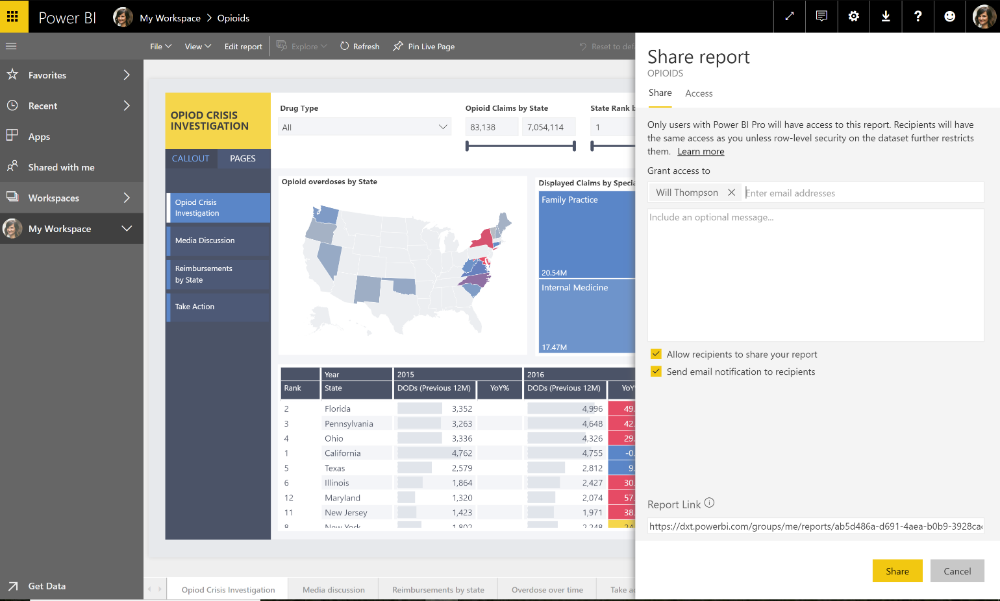

---

title: Share and favorite reports
description: When you share a dashboard, related resources added to the dashboard are also shared.
author: MargoC
manager: AnnBe
ms.date: 05/01/2018
ms.assetid: 3e272f6a-b5ed-478b-98a6-c740150aa2d4
ms.topic: article
ms.prod: 
ms.service: business-applications
ms.technology: 
ms.author: margoc
audience: Admin

---
#  Share and favorite reports

[!include[banner](../../../includes/banner.md)]

When you share a dashboard, related resources added to the dashboard are also
shared. In other words, when report content is pinned to a dashboard, that
report is also shared when you share the dashboard. But, what if a report you
want to share is not on a dashboard, or if you want to share only a report?

The report sharing capability works like the dashboard sharing feature; using
it, you can directly share a report. You can use the sharing pane to control
access rights to a report and send invites to authorized users. When you share a
report with a colleague, the report appears in their [Shared with
me](https://docs.microsoft.com/en-us/power-bi/service-shared-with-me) list.

Share reports in your personal workspace or in an app workspace where you’re a
member. Or share other owners’ reports after they grant you permission.

When you share a report, the underlying dataset is also shared. Row-level
security settings for the dataset remain the same, so recipients see only the
data that they’re authorized to view.

> [!div class="mx-imgBorder"] 
> 

*Example of report sharing*
